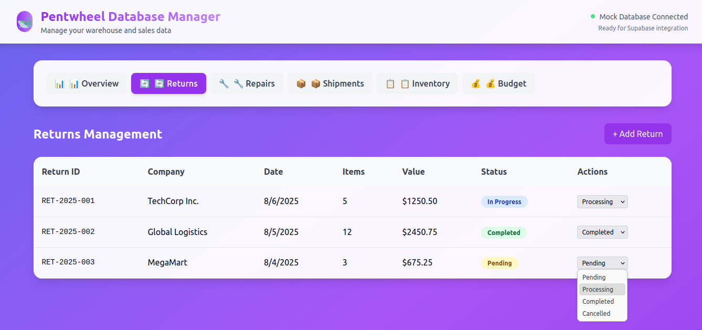

# pentwheel-db
A database management platform that leverages Supabase and Nextjs

 
## Features:  
1. Database Schema (SQL)

- Complete PostgreSQL schema with all necessary tables  
- Relationships between companies, returns, repairs, shipments, components  
- Automatic triggers for timestamps and stock updates  
- Row Level Security (RLS) policies  
- Sample data for testing  

2. Database Management Interface  

- Overview Tab: Real-time metrics and low-stock alerts
- Returns Management: Track and update return status
- Service Repairs: Monitor repair progress and technician assignments
- Shipments: Track incoming/outgoing shipments
- Inventory Management: Component stock levels with alerts
- Budget Management: Track weekly budget usage with progress bars

3. Technical Features

- Full TypeScript support with generated types
- Mock data service (easily replaceable with real Supabase calls)
- Responsive design with Tailwind CSS
- Loading states and error handling
- Status badges and priority indicators
- Real-time visual feedback

## Setup Instructions:  

1. Supabase Setup  
```  
# Create new Supabase project at https://supabase.com
# Copy the SQL schema from the first artifact
# Run it in your Supabase SQL editor
```  
2. Install Dependencies  
```  
npm install @supabase/supabase-js
# All other dependencies are in the updated package.json
```  
3. Environment Configuration  
```  
# Copy .env.example to .env.local
# Add your Supabase project URL and keys
NEXT_PUBLIC_SUPABASE_URL=https://your-project-id.supabase.co
NEXT_PUBLIC_SUPABASE_ANON_KEY=your-anon-key
```  
4. Replace Mock Data  
To connect to real Supabase data, replace the `MockDatabaseService` calls with the actual Supabase service from the `lib/supabase.ts` 

## Key Benefits:  

✅ Full CRUD Operations - Create, read, update, delete data  
✅ Real-time Updates - Supabase real-time subscriptions ready  
✅ Type Safety - Generated TypeScript types from database  
✅ Security - Row Level Security policies implemented  
✅ Scalable - Professional database design with indexes  
✅ User-Friendly - Intuitive interface for warehouse/sales teams  

The platform is currently running with mock data for demonstration, but all the infrastructure is ready for Supabase integration. Simply replace the mock service calls with the real Supabase database service, and you'll have a fully functional warehouse management system!
